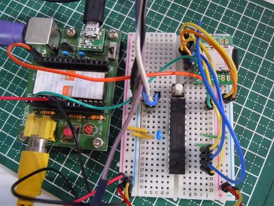
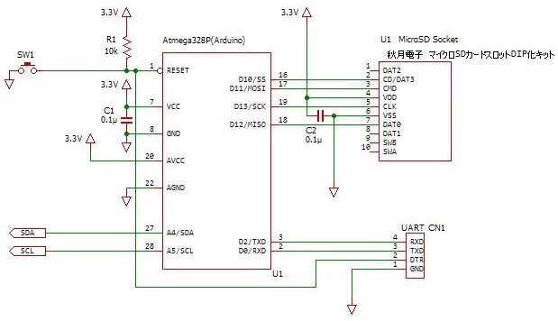

# Ichigoepprom3
IchigoJam用EEPROMエミューレション  

  

##概要  
IchigoJam用EEPROMエミューレションは、IchigoJam用の外部保存メモリ(I2C接続EEPROM)を  
microSDカードに置き換えてエミュレーションを行うモジュールです。  

### 特徴  
- IchigoJamからはEEPROM 24LC1025 (メモリサイズ128kバイト) として認識されます。
- EEPROM用のコマンドが利用出来ます。  
  SAVE 、LOAD、FILES、LRUN  
- EEPROM互換のバイナリ(メモリイメージ)形式保存と非互換のテキスト形式をサポートします。  
  テキスト形式ではパソコン上での編集が可能となります。  

## システム構成
  

## 回路図  
 

SDカードは3.3V動作のため、5V系のArduinoを利用する場合は電圧レベルの変換等の対応が必要です。  

## 仕様  
- プログラム保存可能数: **128個(プログラム番号 100～227)**  
  ※本エミュレーションではSDカード上の利用領域は最大150kバイト程度です。  
- SDカードの対応フォーマット: **FAT16/FAT32**  
- SDカード上のファイル形式  
   
 - ファイルはSDカードの直下(ルート)に配置  
 - ファイル名  
   **プログラム番号3桁半角数字.DAT** ・・ メモリーイメージ(バイナリ)形式  
   **プログラム番号3桁半角数字.TXT** ・・ ANSIテキスト形式    
   通常はメモリーイメージ(バイナリ)形式で保存します。  
   あらかじめ XXX.TXTファイルを作成しておくと、該当プログラム番号のプログラムはテキスト形式での保存となります。  
 - ファイルの日付は2016/5/1 12:00 固定  
 - I2Cスレーブアドレスは7ビットアドレスの0x50、0x54を利用  

## 注意・制約事項  
 - EEPROMを完全にエミュレート出来ていません。ArduinoのWireライブラリの制約上、  
   IchigoJamからI2CW、I2CRコマンドにて直接操作を行う場合、64バイトを超えるサイズの読書きは出来ません。    

## 開発環境  
Arduino IDE 1.6.X   

## 部品  
- ATmega328 (内部オシレータ 8MHz動作、外部クロック 8MHz、16HMzも可能） 
- microSDカードスロット 
- その他（利用するmicroSDカードスロット・モジュールに必要なコンデンサ等の部品)  

### スケッチ(プログラムソース)の書込み    
プログラムソースはフォルダ Ichigoeeprom3/ に格納してます。  
各自の開発環境に配置してArduino IDEにてロードして下さい。  
下記のライブラリを利用していますので、入手して利用可能な状態にして下さい。  
- Arduino I2Cライブラリ Wire改良版　V1.0 https://github.com/Tamakichi/Arduino-AVR-Wire   
※Wire改良版は既存のWireライブラリと競合する場合があります。スケッチコンパイル時は、一時的に既存Wireのフォルダ名を
Wire_org等に書き換える等を行い、コンパイル後は元に戻す等を行って下さい。  

## 実装例  
ブレッドボード  
  

シールド化  
  

openLogを応用した実装   

  

関連記事  
[Arduino(あちゃんでいいの)によるI2C EEPROMのエミュレーション](http://nuneno.cocolog-nifty.com/blog/2016/04/arduinoi2c-eepr.html)  
[Arduino(あちゃんでいいの)によるI2C EEPROMのエミュレーション （２）](http://nuneno.cocolog-nifty.com/blog/2016/05/arduinoi2c-eepr.html)  
[ArduinoによるI2C EEPROMのエミュレーション （３）](http://nuneno.cocolog-nifty.com/blog/2016/05/arduini2c-eepro.html)  
[ArduinoによるI2C EEPROMのエミュレーション （４）](http://nuneno.cocolog-nifty.com/blog/2016/05/arduinoi2c-ee-1.html)  
[ArduinoによるI2C EEPROMのエミュレーション （５）](http://nuneno.cocolog-nifty.com/blog/2016/05/arduinoi2c-ee-2.html)    
[ArduinoによるI2C EEPROMのエミュレーション （６）](http://nuneno.cocolog-nifty.com/blog/2016/11/arduinoi2c-eepr.html)  
